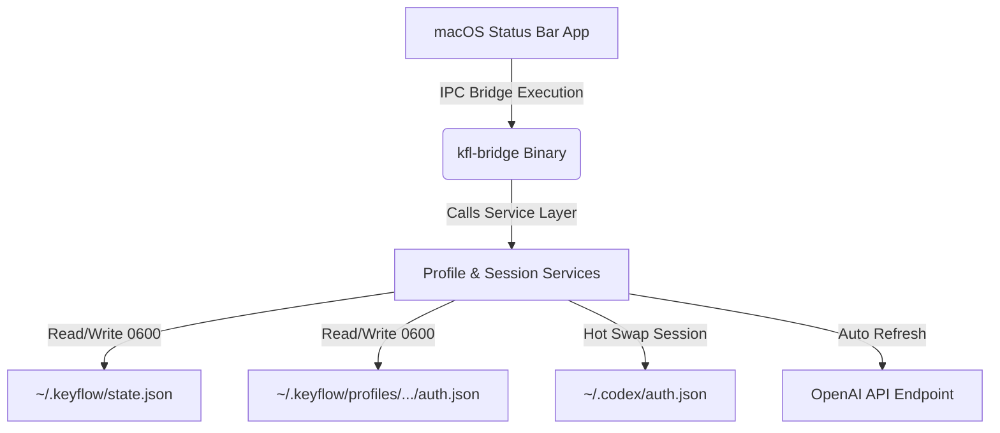

# KeyFlow

<p align="center">
  <pre align="center">
██╗  ██╗███████╗██╗   ██╗███████╗██╗      ██████╗ ██╗    ██╗
██║  ██║██╔════╝╚██╗ ██╔╝██╔════╝██║     ██╔═══██╗██║    ██║
███████║█████╗   ╚████╔╝ █████╗  ██║     ██║   ██║██║ █╗ ██║
██╔══██║██╔══╝    ╚██╔╝  ██╔══╝  ██║     ██║   ██║██║███╗██║
██║  ██║███████╗   ██║   ██║     ███████╗╚██████╔╝╚███╔███╔╝
╚═╝  ╚═╝╚══════╝   ╚═╝   ╚═╝     ╚══════╝ ╚═════╝  ╚══╝╚══╝ 
  </pre>
</p>

<p align="center">
  
  
  
  
</p>

KeyFlow is a premium, macOS-native utility designed to manage and hot-swap multiple OpenAI Codex credential profiles. It bridges a high-performance, asynchronous TypeScript CLI engine with a lightweight, semi-transparent SwiftUI Status Bar application to deliver seamless session management, real-time rate limit tracking, and automatic token refreshes.

---

## 🗺️ System Architecture

KeyFlow utilizes a robust IPC bridge pattern to isolate OS-level interface components from core credential operations:



---

## 🚀 Installation & Building

### 1. Prerequisites
KeyFlow requires **macOS**, **Xcode Command Line Tools** (for compiling the Swift frontend), and **Bun** (version 1.2+):
```bash
# Check Xcode developer command line tool
xcode-select -p

# Check Bun runtime
bun --version
```

### 2. Development Setup
```bash
# Clone the repository
git clone https://github.com/hbui290/keyflow.git
cd keyflow

# Install node dependencies
bun install
```

### 3. Unified Commands
All compilation, testing, and packaging scripts are standardized directly inside `package.json`:

* **Compile Codebases**:
  ```bash
  bun run build
  ```
  *This compiles the TypeScript bridge and Xcode Swift sources into a standalone app bundle at `dist/KeyFlow.app`.*
  > [!NOTE]
  > The application is compiled with an ad-hoc codesign signature (`codesign -s -`). It runs locally out-of-the-box. If copied to another Mac, macOS Gatekeeper may block execution; you will need to allow it under Security & Privacy settings or sign it with a valid Apple Developer Account.

* **Execute Unit Tests**:
  ```bash
  bun run test
  ```
  *Runs the Bun unit tests verifying credentials parsing, state sanitization, and JWT extraction.*

* **Build installer DMG**:
  ```bash
  bun run pack
  ```
  *Generates a shareable installation package disk image at `dist/KeyFlow.dmg`.*

---

## 💻 CLI Commands (`kfl`)

The TypeScript engine can be run directly using the compiled binary `dist/kfl`:

| Command | Description |
| :--- | :--- |
| `kfl add --label <name>` | Initiates a direct browser login flow to capture OpenAI session credentials. |
| `kfl add --label <name> --device-auth` | Headless login using device-code authentication. |
| `kfl use <id-or-label>` | Hot-swaps Codex configuration files and restarts Codex Desktop. |
| `kfl remove <id-or-label> [--purge]` | Deletes profile metadata and optionally purges auth files. |
| `kfl relogin <id-or-label> [--device-auth]` | Re-runs ChatGPT browser login (or device auth) to refresh credentials. |
| `kfl prime [--account <id-or-label>]` | Primes the 5-hour ChatGPT session by sending a minimal background message. |
| `kfl status [--json]` | Prints active session health, plan type, and token validity. |
| `kfl refresh [--all]` | Manually triggers rate-limit token refresh calls. |
| `kfl doctor` | Runs diagnostics checks on directories, file permissions, and active configurations. |
| `kfl link-current` | Automatically registers and backups the pre-existing `~/.codex/auth.json`. |

---

## 🔒 Storage & Security (POSIX Compliance)

KeyFlow takes security seriously and isolates profiles strictly inside the user's home directory:
* **Storage Root**: `~/.keyflow/` (Created with **`0700`** directory permissions to deny external group reads).
* **Metadata State**: `~/.keyflow/state.json` (Stores local credentials metadata, written using **`0600`** permissions).
* **Backups**: `~/.keyflow/backups/` (Hosts encrypted Codex session history backups).

*Never commit directories under `~/.keyflow/` or any generated `auth.json` files to Git.*

---

## 🎨 Visual Identity

The interface is engineered to adhere to Apple's Human Interface Guidelines (HIG):
* **Monochrome Stencil Icon**: Uses a solid rounded rectangle with a `.destinationOut` blend mask đục lỗ to let macOS background gradients shine through the logo glyph.
* **Frosty Glasspopover**: Displays metadata lists using a `0.75` opacity native translucent surface.
* **GlowProgressBar**: Reflects weekly usage percent using glow effect progress bars matching account plan tiers.

Contrast parameters are validated to be **WCAG AA Compliant** (`warnings: 0`) using the Google Labs Design Linter.

---

## 📖 Specifications Index

For complete developer specs and architectural decisions, explore:
* [**`PRODUCT.md`**](PRODUCT.md): Detailed product statement, persona definitions, and design goals.
* [**`USERFLOW.md`**](USERFLOW.md): Sequence diagrams mapping Add, Switch, Sync, and Quota Refresh operations.
* [**`DESIGN.md`**](DESIGN.md): Normalized design tokens, layouts, colors, and typography rules.
* [**`AGENTS.md`**](AGENTS.md): Repository instructions and constraints for developer AI agents.

---

## 📄 License

KeyFlow is distributed under the MIT License. See [LICENSE](LICENSE) for details.
