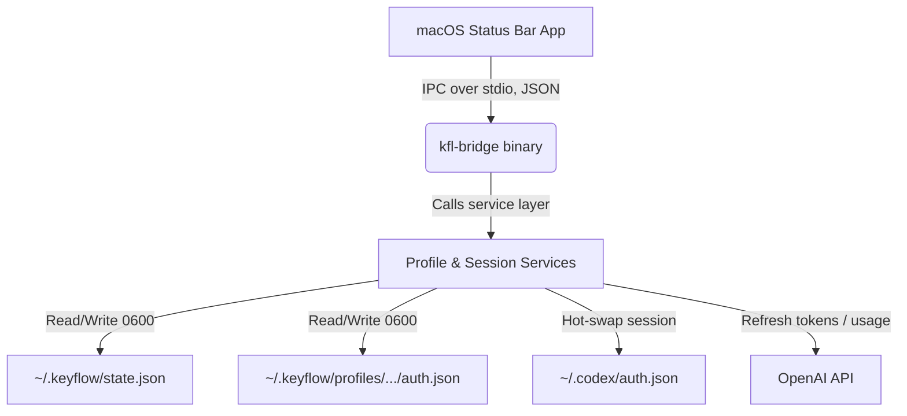

# KeyFlow

<p align="center">
  <pre align="center">
██╗  ██╗███████╗██╗   ██╗███████╗██╗      ██████╗ ██╗    ██╗
██║  ██║██╔════╝╚██╗ ██╔╝██╔════╝██║     ██╔═══██╗██║    ██║
███████║█████╗   ╚████╔╝ █████╗  ██║     ██║   ██║██║ █╗ ██║
██╔══██║██╔══╝    ╚██╔╝  ██╔══╝  ██║     ██║   ██║██║███╗██║
██║  ██║███████╗   ██║   ██║     ███████╗╚██████╔╝╚███╔███╔╝
╚═╝  ╚═╝╚══════╝   ╚═╝   ╚═╝     ╚══════╝ ╚═════╝  ╚══╝╚══╝
  </pre>
</p>

<p align="center">
  
  
  
</p>

KeyFlow is a macOS-native utility for managing and hot-swapping multiple OpenAI Codex credential profiles. It pairs an asynchronous TypeScript/Bun CLI engine with a lightweight SwiftUI status bar app to deliver 1-click session switching, live rate-limit tracking, and automatic token refresh.

---

## Why KeyFlow

The official Codex Desktop app only supports one signed-in account at a time. Developers juggling multiple ChatGPT accounts (Plus, Team, Enterprise) to spread out rate limits have to manually log out and back in — disruptive and error-prone. KeyFlow keeps every account's credentials in an isolated local profile and hot-swaps the active one in a click, from either the CLI or the menu bar.

---

## System Architecture



The Swift app never touches credentials directly — every read/write goes through the `kfl-bridge` binary over a JSON IPC contract, keeping the two codebases decoupled.

---

## Installation & Building

### 1. Prerequisites

macOS, Xcode Command Line Tools (for the Swift frontend), and Bun 1.2+:

```bash
xcode-select -p
bun --version
```

> [!NOTE]
> Running the `apps/macos` test target (`swift test`) requires a full Xcode.app install, not just Command Line Tools — the `XCTest` module isn't bundled with CLT alone.

### 2. Development Setup

```bash
git clone https://github.com/hbui290/keyflow.git
cd keyflow
bun install
```

### 3. Unified Commands

All compilation, testing, and packaging scripts are defined in `package.json`:

| Script | What it does |
| :--- | :--- |
| `bun run build` | Compiles the TypeScript CLI/bridge and builds the Swift app bundle into `dist/KeyFlow.app`. |
| `bun run test` | Runs the Bun unit tests (`src/core/services.test.ts`). |
| `bun run pack` | Packages `dist/KeyFlow.app` into an installable `dist/KeyFlow.dmg`. |

> [!NOTE]
> The app is signed ad-hoc (`codesign -s -`). It runs locally out of the box; if copied to another Mac, Gatekeeper may block it until allowed under Security & Privacy, or the app is signed with a real Apple Developer certificate.

---

## CLI Commands (`kfl`)

Run directly from the compiled binary at `dist/kfl`:

| Command | Description |
| :--- | :--- |
| `kfl add --label <name> [--device-auth]` | Adds an account via browser login, or headless device-code auth with `--device-auth`. |
| `kfl use <id-or-label>` | Hot-swaps Codex's credentials to this account and restarts Codex Desktop. |
| `kfl relogin <id-or-label> [--device-auth]` | Re-authenticates an account whose token has expired. |
| `kfl remove <id-or-label> [--purge]` | Removes an account; `--purge` also deletes its cached profile directory. |
| `kfl prime [--account <id-or-label>]` | Sends a minimal background message to keep the 5-hour session window active. |
| `kfl status [--json]` | Prints active account, usage, and link health. |
| `kfl refresh [--all]` | Manually refreshes usage/rate-limit data for the active account, or all of them. |
| `kfl doctor` | Runs environment diagnostics (Codex install, directory permissions, active links). |
| `kfl link-current` | Imports whatever account is currently logged into `~/.codex/auth.json` as a new profile. |

---

## Storage & Security

KeyFlow keeps every credential inside the user's home directory, never in the repo or a shared location:

* **`~/.keyflow/`** — root directory, created with `0700` permissions (owner-only access).
* **`~/.keyflow/state.json`** — account metadata, written with `0600` permissions.
* **`~/.keyflow/profiles/<id>/auth.json`** — per-account credentials, `0600`.
* **`~/.keyflow/backups/`** — timestamped snapshots of Codex's active `auth.json`, taken before every switch. These are plain files protected by filesystem permissions, not encrypted — treat the directory itself as sensitive.

Never commit anything under `~/.keyflow/`, or any `auth.json`/`state.json`, to version control.

---

## Visual Identity

The interface follows Apple's Human Interface Guidelines for status bar apps:

* **Monochrome stencil icon** — a solid rounded rectangle with a `.destinationOut` blend mask cutting out the glyph, so the menu bar's own background shows through instead of a hardcoded color.
* **Translucent popover** — metadata lists sit on a `0.75`-opacity native vibrancy surface.
* **Glow progress bars** — usage meters render with a soft glow, colored by plan tier and remaining quota.

Full design tokens (colors, type scale, spacing, component specs) live in [`docs/DESIGN.md`](docs/DESIGN.md).

---

## Documentation

* [`docs/PRODUCT.md`](docs/PRODUCT.md) — product vision, target users, architecture, feature set.
* [`docs/USERFLOW.md`](docs/USERFLOW.md) — sequence diagrams for Add, Switch, Sync, Re-login, and Usage Refresh.
* [`docs/DESIGN.md`](docs/DESIGN.md) — design tokens: colors, typography, spacing, component rules.
* [`AGENTS.md`](AGENTS.md) — build/test/validation rules for anyone (human or AI) contributing code.

---

## License

KeyFlow is distributed under the MIT License. See [LICENSE](LICENSE) for details.
