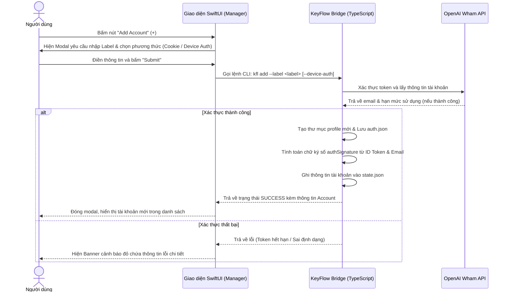
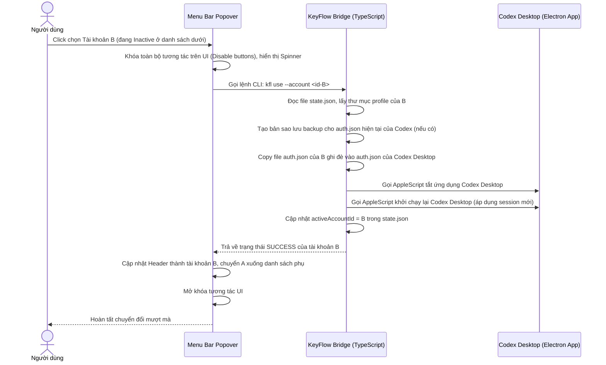
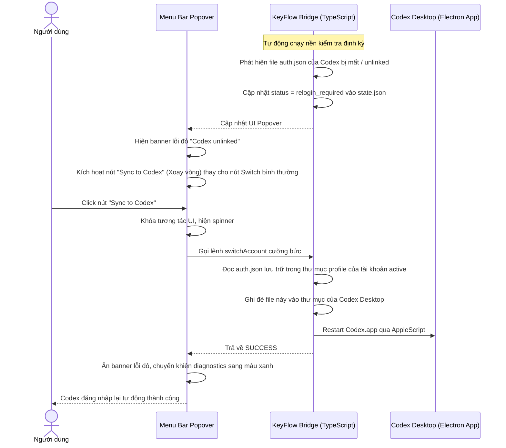
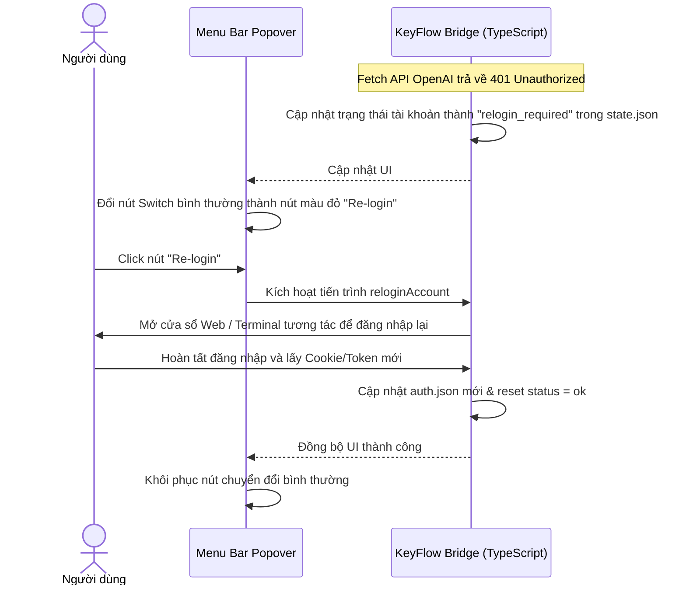
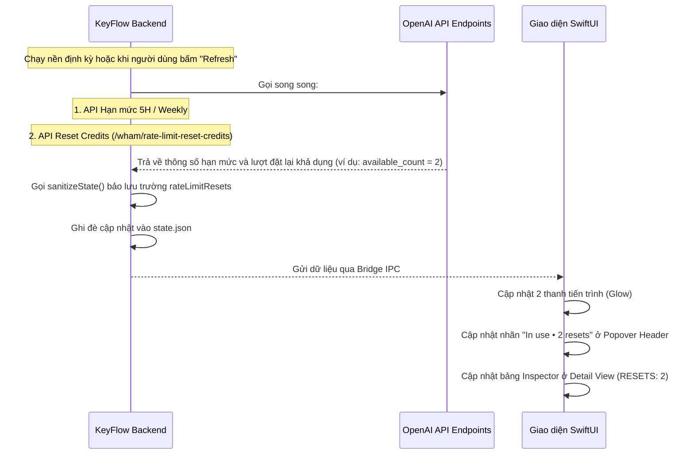

# User Flows & Interactions Guide - KeyFlow (Codex Switch)

Tài liệu này đặc tả chi tiết toàn bộ các luồng tương tác (User Flows), kịch bản phản hồi giao diện, và các điểm chạm hệ thống của ứng dụng **KeyFlow** trên macOS.

---

## Flow 1: Thêm tài khoản mới (Add Account Flow)

Luồng tương tác khi người dùng muốn đưa một tài khoản ChatGPT mới vào hệ thống quản lý.

---

## Flow 2: Chuyển đổi tài khoản (Switch / Use Account Flow)

Luồng hoạt động khi người dùng kích hoạt chuyển đổi phiên đăng nhập từ tài khoản hiện tại sang tài khoản khác.

---

## Flow 3: Đồng bộ ngược cưỡng bức (Sync to Codex Flow)

Kịch bản cứu hộ khi ứng dụng Codex Desktop bị đăng xuất ngoài ý muốn (mất file auth) nhưng KeyFlow vẫn đang lưu session hoạt động của tài khoản đó.

---

## Flow 4: Đăng nhập lại khi hết hạn phiên (Re-login Flow)

Luồng tương tác khi một tài khoản phụ bị hết hạn token (Cookie chết, đổi mật khẩu) và cần đăng nhập lại để cập nhật phiên.

---

## Flow 5: Tra cứu hạn mức và lượt reset (Check Usage & Resets)

Luồng đồng bộ dữ liệu sử dụng theo thời gian thực (5H, Weekly, Resets remaining) từ OpenAI về giao diện.

