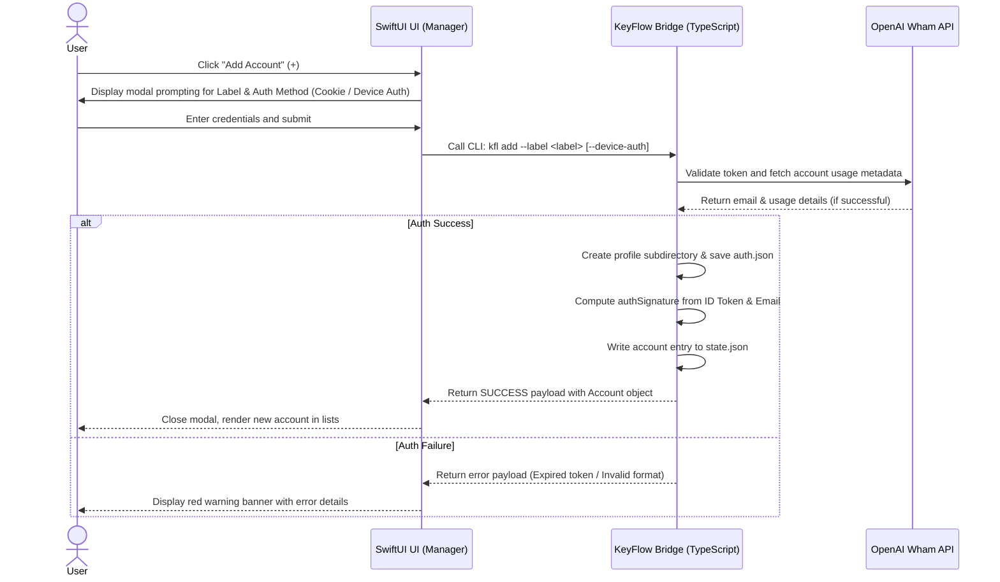
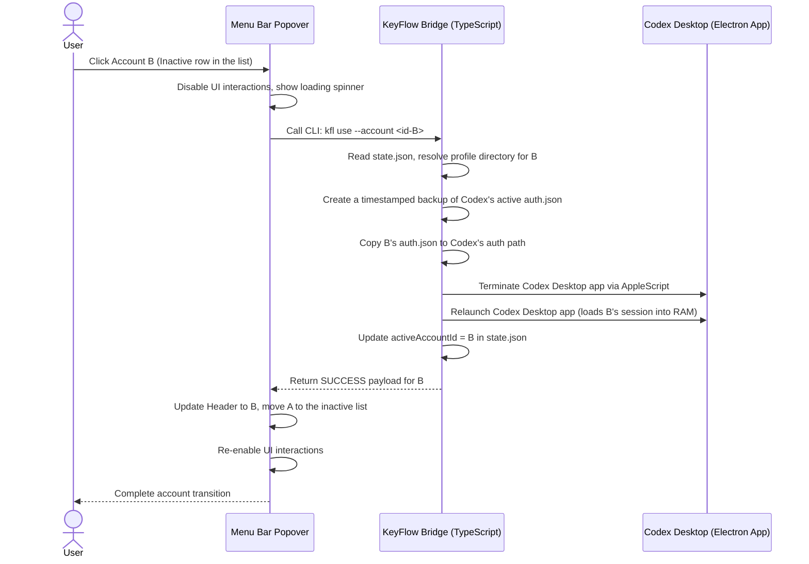
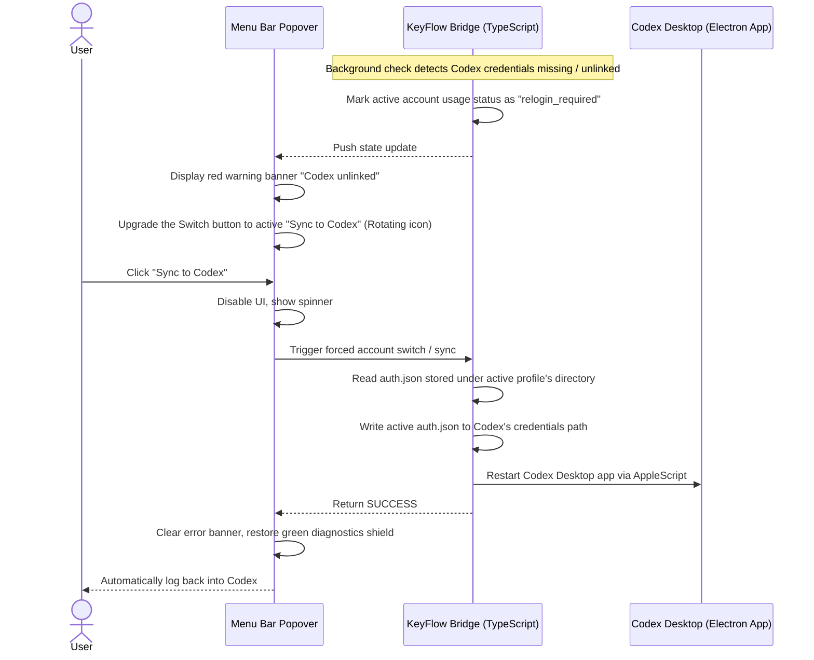
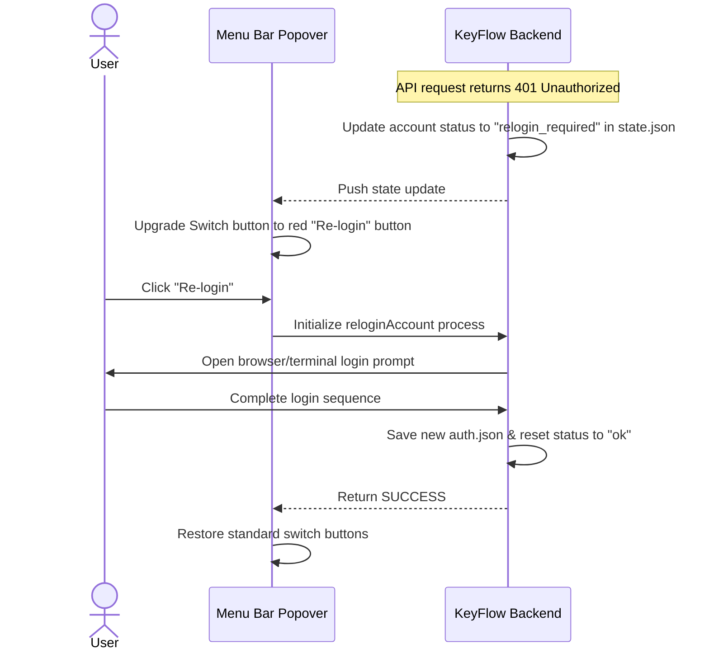
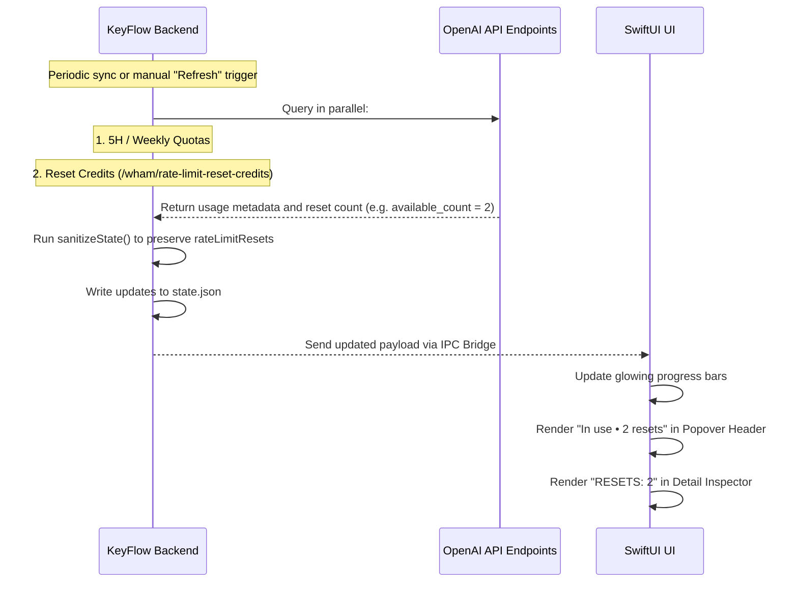

# User Flows & Interactions Guide - KeyFlow (Codex Switch)

This document details the user flows, UI response behaviors, and system interaction sequences of the **KeyFlow** application on macOS.

---

## Flow 1: Add Account Flow

Triggered when a user connects a new ChatGPT profile to KeyFlow.

---

## Flow 2: Switch Account Flow

Triggered when the user switches their active Codex session to a different account.

---

## Flow 3: Active Codex Syncing (Sync to Codex Flow)

A rescue sequence when the Codex Desktop application is logged out (missing auth credentials) but KeyFlow retains a valid session for the active account.

---

## Flow 4: Re-login Flow

Triggered when a session token expires, prompting the user to re-authenticate the account.

---

## Flow 5: Check Usage & Resets Flow

Synchronizes 5H, Weekly usage, and rate-limit reset credits from OpenAI to the UI.

