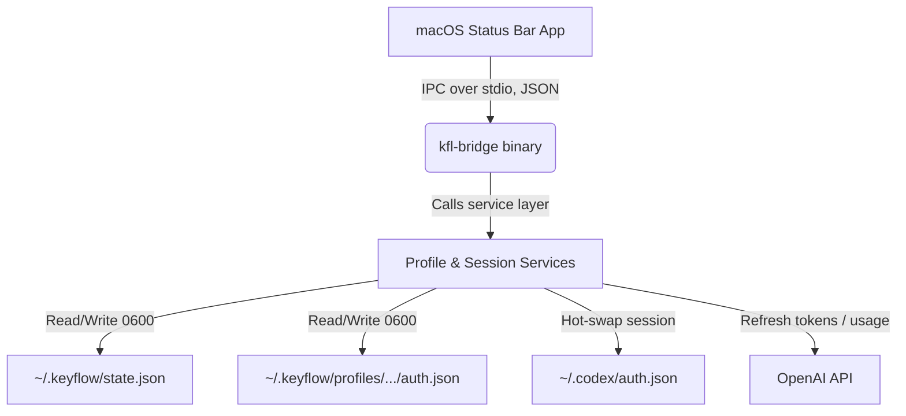

# Development Guide — KeyFlow

How to build, test, and package KeyFlow from source. For product/UX/design specs, see the other documents in this folder; for contribution ground rules, see [`AGENTS.md`](../AGENTS.md).

---

## Prerequisites

macOS, Xcode Command Line Tools (for the Swift frontend), and Bun 1.2+:

```bash
xcode-select -p
bun --version
```

> [!NOTE]
> Running the `apps/macos` test target (`swift test`) requires a full Xcode.app install, not just Command Line Tools — the `XCTest` module isn't bundled with CLT alone.

## Setup

```bash
git clone https://github.com/hbui290/keyflow.git
cd keyflow
bun install
```

## Project Layout

```
src/                 TypeScript backend — CLI (kfl), IPC bridge (kfl-bridge), core services
apps/macos/          Swift/SwiftUI status bar app (SwiftPM package)
scripts/             App bundle + DMG packaging scripts
docs/                Product, user-flow, design, and release documentation
dist/                Build outputs (gitignored): kfl, kfl-bridge, KeyFlow.app, KeyFlow.dmg
```

## Build, Test, Package

All scripts are defined in `package.json`:

| Script | What it does |
| :--- | :--- |
| `bun run typecheck` | TypeScript type check (`tsc --noEmit`) — must pass with zero errors. |
| `bun run test` | Runs the Bun unit tests (`src/core/services.test.ts`). |
| `bun run compile` | Compiles standalone `dist/kfl` and `dist/kfl-bridge` binaries. |
| `bun run build` | `compile` + builds the Swift app into `dist/KeyFlow.app` (bridge binaries bundled inside). |
| `bun run pack` | Packages `dist/KeyFlow.app` into an installable `dist/KeyFlow.dmg`. |

The Swift app can also be built/tested directly:

```bash
cd apps/macos
swift build -c release
swift test        # requires full Xcode (see note above)
```

## Code Signing

The build signs the app **ad-hoc** (`codesign -s -`). It runs locally out of the box; when copied to another Mac, Gatekeeper may block it until the user allows it under **System Settings → Privacy & Security**, or the app is signed with a real Apple Developer certificate.

## Architecture Overview



The Swift app never touches credentials directly — every read/write goes through the `kfl-bridge` binary over a JSON IPC contract, keeping the two codebases decoupled. State writes are serialized behind a `state.lock` file so the CLI and the app's background refresh can't corrupt `state.json` concurrently.

## Releasing

1. `bun run build && bun run pack` — produces `dist/KeyFlow.dmg`.
2. Create a GitHub Release and attach the DMG as an asset — build outputs are gitignored and never committed.
3. Follow [`GITHUB_RELEASE.md`](GITHUB_RELEASE.md) for release-notes content and repository metadata.
