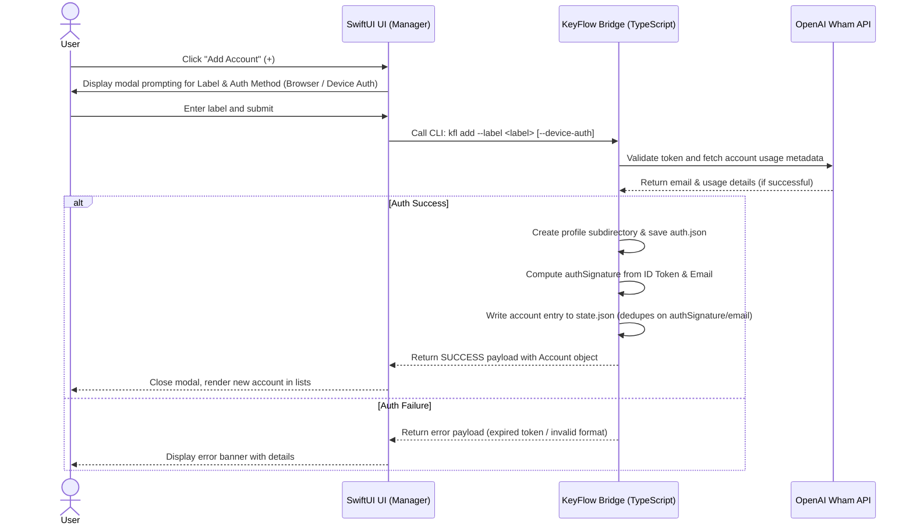
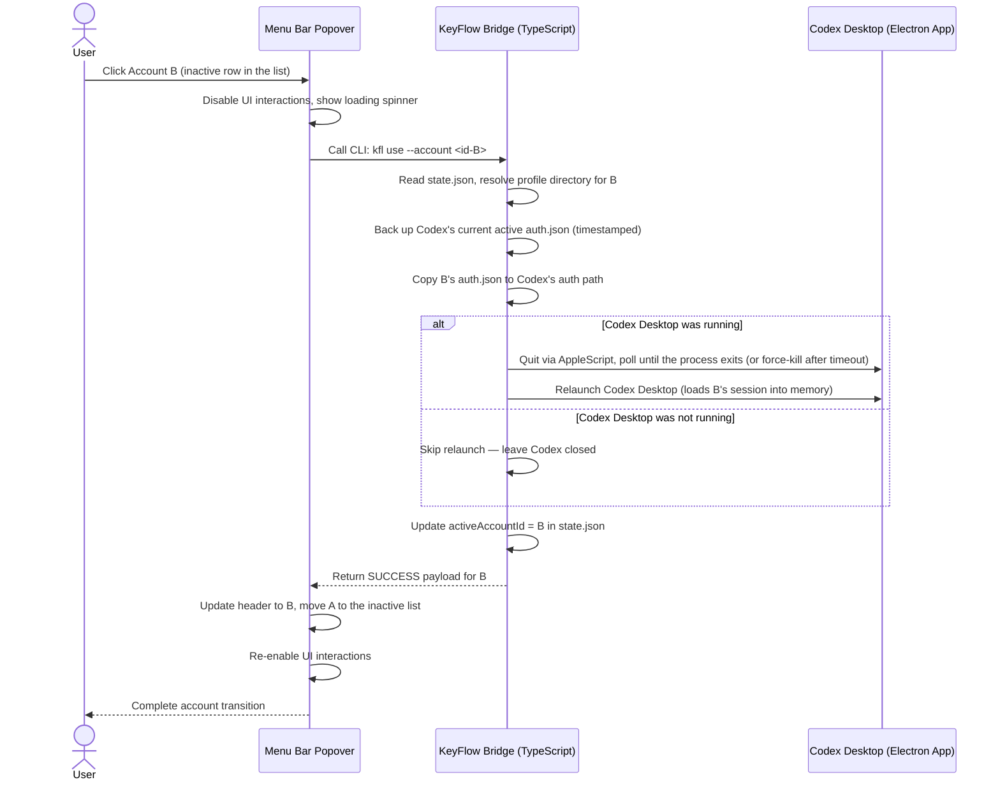
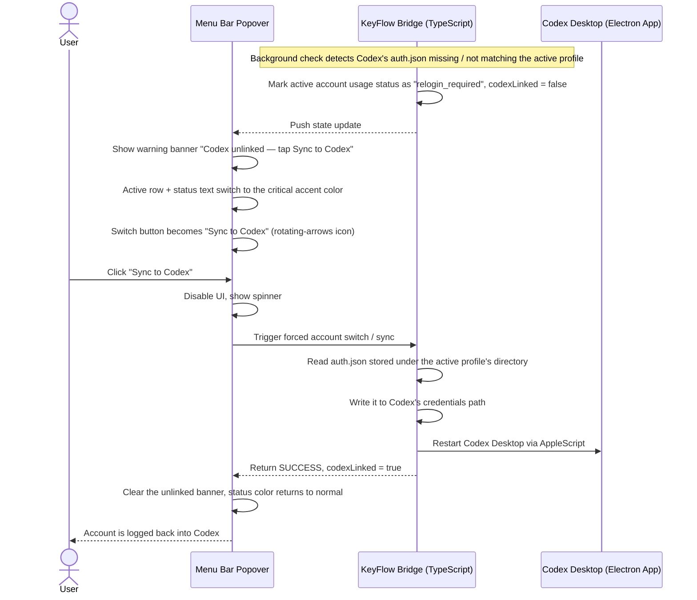
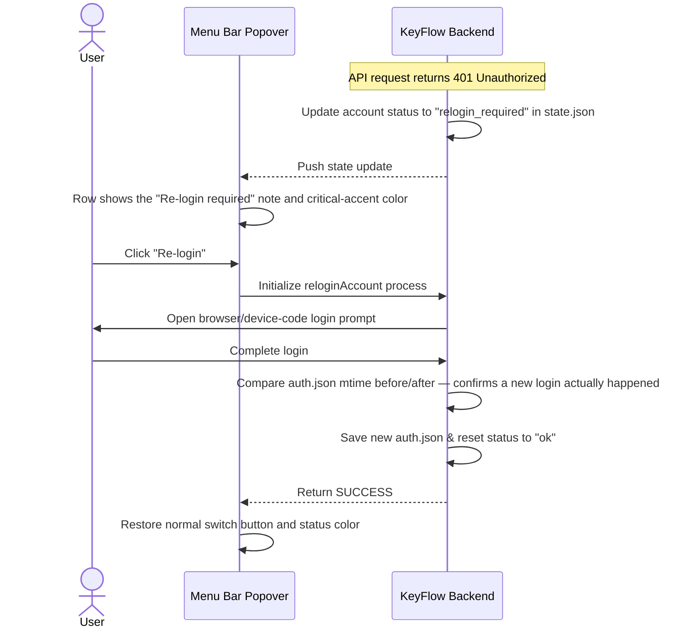
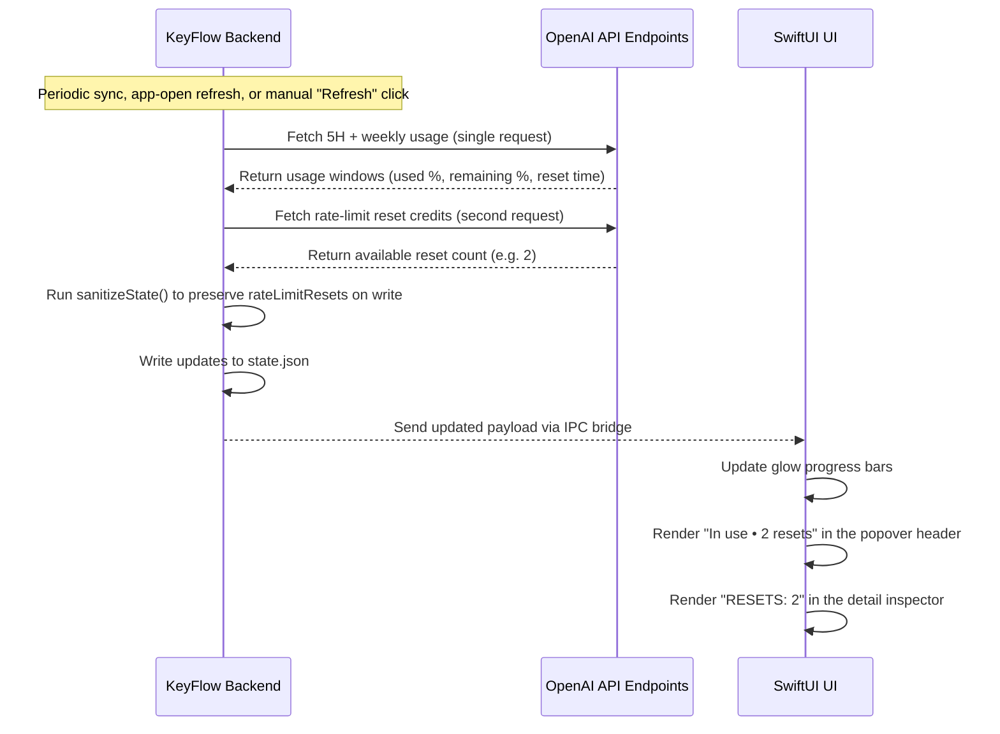

# User Flows & Interactions — KeyFlow

This document details the user flows, UI response behaviors, and system interaction sequences of the KeyFlow application.

---

## Flow 1: Add Account

Triggered when a user connects a new ChatGPT profile to KeyFlow.

---

## Flow 2: Switch Account

Triggered when the user switches their active Codex session to a different account.

---

## Flow 3: Sync to Codex

A rescue sequence for when Codex Desktop has lost its credentials (missing or stale `auth.json`) while KeyFlow still holds a valid session for the active account — most commonly after a token rotation that didn't propagate, or Codex being logged out externally.

---

## Flow 4: Re-login

Triggered when a session token expires or is revoked, prompting the user to re-authenticate.

---

## Flow 5: Usage & Reset Credits Refresh

Synchronizes 5-hour usage, weekly usage, and rate-limit reset credits from OpenAI to the UI.

